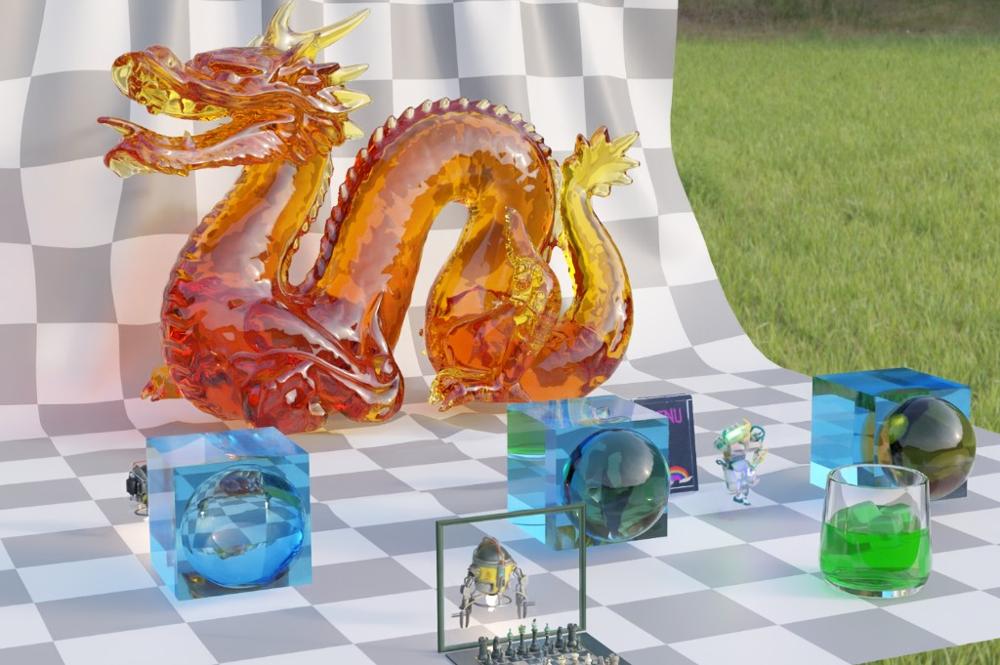
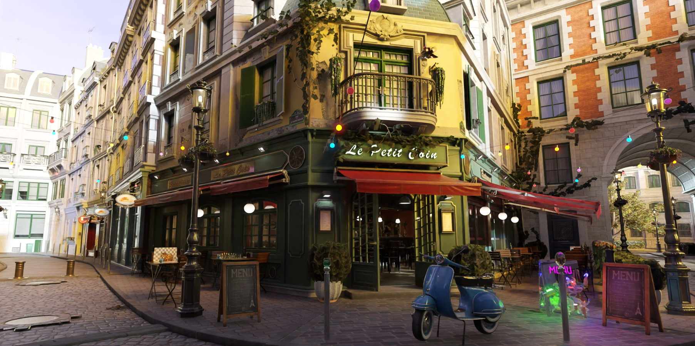
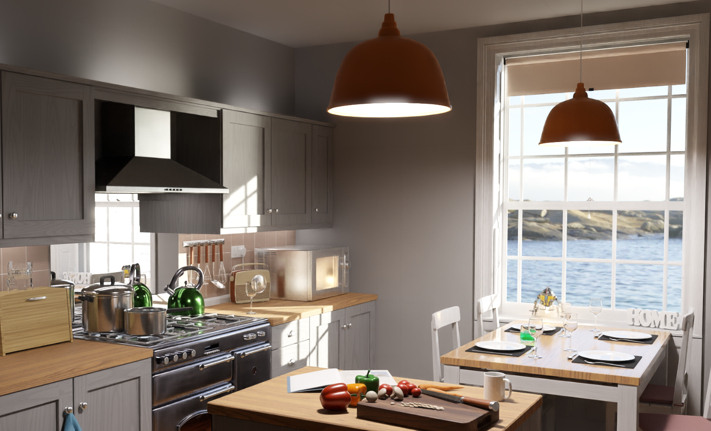

# Caustica

<p align="center">
  
</p>

<p align="center">
  
  &nbsp;
  
</p>

<p align="center"><i>Path-traced synthetic imagery for embodied-AI simulation: material showcase (top), outdoor bistro and indoor kitchen environments (bottom).</i></p>

## Overview

Caustica is a modern ray tracing renderer aimed primarily at **embodied AI and robotics simulation** — generating photorealistic synthetic images, multi-view camera feeds, and ground-truth-quality references for perception, manipulation, and sim-to-real workflows.

It takes **RTX Path Tracing (RTXPT)** as its functional and shading reference, but reimplements the runtime around a cleaner engine architecture that is easier to embed in simulation stacks:

* **Simulation-friendly runtime** — Bevy-inspired ECS (`App`, `Plugin`, `ecs::World`, `AppSchedule` systems) for scenes made of robots, objects, lights, and cameras that update every simulation step
* **Production-style rendering** — Unreal Engine–inspired pipeline (`WorldRenderer`, render graph, pass features) for stable real-time previews and batch offline captures from the same scene description
* **Physically based imagery** — path-traced diffuse/specular/transmission/fuzz (**OpenPBR**), dynamic lighting (**ReSTIR DI/GI/PT**), and denoising/upscaling (**NRD**, **DLSS**) to reduce the visual gap between synthetic and real sensor data

Typical embodied-AI uses include: domain-randomized tabletop/manipulation scenes, indoor navigation environments, multi-camera rig rendering, scripted material/lighting variations, and headless dataset generation from Python.

At a high level:

* **Application & simulation layer** — Bevy-inspired ECS: `App`, `Plugin`, `ecs::World`, resources, and ordered `AppSchedule` systems (`Startup` → `Update` → `Extract` → `Render` → …).
* **Rendering layer** — Unreal Engine–inspired pipeline: `WorldRenderer`, render features, pass graph (`GraphBuilder`), transient resource pools, and pipeline plugins that assemble frame work from declarative passes.
* **Path tracing core** — RTXPT-derived shaders and algorithms, including **ReSTIR PT**, **ReSTIR GI**, **ReSTIR DI**, NEE-AT, path-space decomposition, denoiser guides, NRD, and **DLSS**, wired through the engine stack

The result is a pure path tracer (no rasterization in the main light transport path) suited to both **interactive simulation preview** and **offline / headless synthetic-data rendering**.

## Embodied AI & simulation rendering

Caustica is designed as a **rendering backend** for embodied-intelligence pipelines, not as a full physics or robot-control simulator. A typical integration looks like:

```
Simulation / policy stack          Caustica
─────────────────────────          ────────
physics, kinematics, control  →     scene ECS update (poses, joints, attachments)
sensor rig definition         →     scene JSON cameras + Python camera API
domain randomization          →     `.material.json` / lights / env maps / scene variants
batch or online inference     →     headless `caustica.Renderer`, accumulation, PNG/export
```

What fits embodied-AI workflows well:

| Need | Caustica capability |
| --- | --- |
| Programmatic scenes | [Scene JSON](docs/scene-json.md) — models, transforms, lights, cameras, animation channels |
| Consistent object appearance | **OpenPBR** materials + glTF import with per-model `.material.json` overrides |
| Multi-view / sensor rigs | Multiple scene cameras; runtime camera selection and transform control via Python/C++ |
| Interactive + batch modes | Real-time path tracing with denoisers; reference accumulation for ground-truth frames |
| Headless farm rendering | Python `Renderer(..., headless=True)` — no window/swap chain; see `caustica/Python/Examples/offline_render.py` |
| Automation & tuning | Python extension (`pip install .`) for offline jobs; embed mode for live parameter edits in the editor |
| Dynamic environments | Scene graph animation, emissive/analytic lights, environment maps, 3D Gaussian splats |

Recommended starting points:

* Scene authoring: [docs/scene-json.md](docs/scene-json.md)
* Materials for sim-to-real variation: [docs/openpbr.md](docs/openpbr.md)
* ECS + render proxies: [docs/architecture-render-proxy.md](docs/architecture-render-proxy.md)
* Python batch/headless API: [py_caustica.md](py_caustica.md), `caustica/Python/Examples/offline_render.py`

## Architecture

```
App (frame loop, plugins, schedules)
 └── App world (resources) + SceneEntityWorld (scene ECS)
      ├── Update / PostUpdate   — animation, hierarchy, simulation
      ├── Extract               — ECS → SceneRenderData proxies (triple-buffered)
      └── Render (RT)           — WorldRenderer reads proxies only (no live ECS)

WorldRenderer (UE-like render pipeline)
 ├── PathTracingContext            — persistent GPU state, settings, bindings
 ├── RenderPipelineRegistry        — ordered render features / plugins
 ├── Frame graph (GraphBuilder)    — transient targets, pass edges
 └── Path-trace / ReSTIR / NRD / DLSS features
```

**ECS × Render Proxy:** logic thread owns `SceneEntityWorld`; Extract copies lights/meshes into `LightRenderProxy` / `MeshInstanceRenderProxy`; the render thread consumes `Scene::getRenderData()` and must not walk live ECS for frame lighting. Details: [docs/architecture-render-proxy.md](docs/architecture-render-proxy.md).

* **Application & simulation layer** — Bevy-inspired: `App`, `Plugin`, schedules, scene ECS components.
* **Rendering layer** — UE-inspired: dedicated `RenderThread`, extract proxies, `WorldRenderer`, render graph.
* **Path tracing core** — RTXPT-derived shaders (ReSTIR, NEE-AT, NRD, DLSS) wired through the proxy packet.

Key code locations:

| Layer | Paths |
| --- | --- |
| App & schedules | `caustica/caustica/include/engine/App.h`, `AppSchedules.h`, `Plugin.h` |
| ECS core | `caustica/caustica/include/ecs/` |
| Scene ECS | `caustica/caustica/include/scene/SceneEcs.h` |
| Render proxies | `caustica/caustica/include/scene/SceneRenderData.h`, `docs/architecture-render-proxy.md` |
| World renderer | `caustica/caustica/include/render/worldRenderer/` |
| Render graph | `caustica/caustica/include/render/graph/` |
| Materials (OpenPBR) | `caustica/caustica/src/render/passes/lighting/MaterialGpuCache.cpp`, `shaders/PathTracer/Rendering/Materials/BxDF.hlsli` |
| Path tracing shaders | `caustica/caustica/shaders/PathTracer/` |
| Sample app | `application/editor/app/Main.cpp` |

## Features

### Simulation integration

* **Scene JSON** workflow for reproducible environments, object placement, lights, and camera rigs
* **ECS scene graph** (`SceneEntityWorld`) — entities/components map naturally to simulated actors and attachments
* **Python extension** — headless and windowed `Renderer`, per-frame settings, camera/scene/material control, accumulation for dataset generation
* **Reference + real-time modes** — interactive policy/debug preview and high-SPP offline captures from the same scene
* glTF/OBJ asset import for props, robots, and scanned environments; animation channels for moving parts

### Path tracing & light transport

* Pure path tracer — no rasterization in the main light transport path
* Reference and real-time modes
* Simple BSDF model that is easy(ish) to extend
* Volumes and nested dielectrics with priority
* Analytic lights (directional, spot, point), emissive triangles, and environment map lighting
* NEE with feedback-based, temporally adaptive guided importance sampling (NEE-AT)
* Low-discrepancy sampling ([Practical Hash-based Owen Scrambling](https://jcgt.org/published/0009/04/01/paper.pdf)), RayCones for texture MIP selection, RR early termination, firefly filter

### ReSTIR / RTXDI (via RTXDI SDK)

Integrated through `RtxdiPass` and RTXDI compute/ray-tracing shaders:

* **ReSTIR DI** — resampled direct illumination for analytic and emissive lights; temporal/spatial resampling, checkerboard modes, fused DI+GI final shading
* **ReSTIR GI** — resampled indirect lighting from secondary hits; temporal/spatial resampling and boiling filter
* **ReSTIR PT** — path-level resampling with initial sampling, hybrid shift, reconnection, temporal/spatial resampling, and boiling filter
* ReGIR light presampling support for large light counts

Key paths: `caustica/caustica/src/render/passes/rtxdi/`, `caustica/caustica/shaders/render/rtxdi/`

### Denoising, anti-aliasing & upscaling

* **NRD** — ReLAX and ReBLUR with up to 3-layer path-space decomposition
* **DLSS** (when enabled at build time):
  * **DLSS Super Resolution (SR)** — spatial upscaling via Streamline (Windows) or native NGX (Linux Vulkan)
  * **DLSS Ray Reconstruction (RR)** — neural denoising/AA using path-tracing guide buffers (diffuse/specular albedo, normal/roughness, motion, depth)
  * **DLSS AA** and quality presets (Performance / Balanced / Quality / DLAA, etc.)
  * **DLSS Frame Generation (FG)** and Reflex via Streamline on Windows
* TAA, tone mapping, bloom, and accumulation for non-DLSS paths
* Reference-mode OptiX denoiser for offline captures

### OpenPBR material system

Caustica uses **OpenPBR** as the built-in material model on top of the internal `PTMaterial` GPU/shader backend. Scene materials are authored in `Assets/Materials/*.material.json` (see [scene JSON](docs/scene-json.md#材质覆盖)); existing legacy field names remain valid.

* **Authoring model** — set `MaterialModel` to `"OpenPBR"` (default for new materials) and write parameters in OpenPBR snake_case (`base_color`, `coat_weight`, `subsurface_radius`, …) or inside an `OpenPBR` JSON block
* **Shader lobes** — diffuse/base, GGX specular (with **anisotropy**), specular/diffuse **transmission**, **fuzz**, **coat** (with darkening), **thin-film** iridescence, **dispersion**, and **subsurface** (lobe mix + homogeneous scatter)
* **Backward compatible** — legacy `BaseOrDiffuseColor`, `Metalness`, `Roughness`, ORM textures, and related RTXPT-era fields still load and bake to the same GPU layout
* **Editor UI** — material inspector shows OpenPBR names when `MaterialModel` is `"OpenPBR"` and converts internally to `PTMaterial` constants

Approximate vs full spec: subsurface uses homogeneous volume scattering rather than a full BSSRDF random walk; coat/base share one shading normal; energy balance is approximate (Turquin MS + coat attenuation).

Example:

```json
{
  "MaterialModel": "OpenPBR",
  "OpenPBR": {
    "base_color": [0.55, 0.48, 0.40],
    "base_metalness": 0.0,
    "specular_weight": 0.45,
    "specular_roughness": 0.82,
    "specular_roughness_anisotropy": 0.45,
    "fuzz_weight": 0.35,
    "fuzz_roughness": 0.75
  },
  "NormalTexture": { "path": "Textures/weave_n.dds", "NormalMap": true }
}
```

Key paths: `caustica/caustica/src/render/passes/lighting/MaterialGpuCache.cpp`, `caustica/caustica/shaders/PathTracer/Rendering/Materials/BxDF.hlsli`

Full field reference: [OpenPBR materials](docs/openpbr.md)

### Rendering platform & assets

* DirectX 12 and Vulkan back-ends
* Shader Execution Reordering (SER) and Opacity Micromaps (OMM) on supported DXR 1.2 builds
* glTF 2.0 asset pipeline (subset of extensions, including animation) with **OpenPBR** `.material.json` overrides
* RTXTF stochastic texture filtering
* 3D Gaussian Splat rendering and shadow proxy support

## Requirements

- Windows 10 20H1 (version 2004-10.0.19041) or newer
- DXR-capable GPU (DirectX Raytracing 1.1 API or higher; if DXR 1.2 is not available, disable Agility SDK 1.619 in CMake settings)
- Recent GPU driver with DXR support
- DirectX 12 or Vulkan API
- CMake v4.02+
- Visual Studio 2022 (v143 build tools) or later with Windows 10 SDK version 10.0.20348.0 or 10.0.26100.0 or later

## Known Issues

* By default, Agility SDK 1.619 is enabled and requires DXR 1.2 (Shader Model 6.9). The current setup can only switch to older shader models at build configuration time. If your GPU does not support DXR 1.2 with Shader Model 6.9, set `CAUSTICA_D3D_AGILITY_SDK_PATH`, `CAUSTICA_D3D_AGILITY_SDK_VERSION`, and `CAUSTICA_D3D_AGILITY_SDK_VERSION_NAME` CMake variables to empty before cleaning the `/bin` folder, re-configuring, and rebuilding.
* Enabling Vulkan support requires a couple of manual steps; see [Building Vulkan](#building-vulkan).
* SER and OMM support on Vulkan is currently work in progress.
* Running Vulkan on AMD GPUs may trigger a TDR during TLAS building in scenes with null TLAS instances.
* Enabling the Vulkan debug layer will show a number of warnings and errors; fixes are work in progress.
* For frame capture and GPU profiling, a vendor graphics debugger is recommended. If using tools such as PIX on Windows, disable `RHI_WITH_NVAPI` and `CAUSTICA_WITH_STREAMLINE` in CMake to avoid compatibility issues. Disabling these settings reduces performance and removes some features.
* There is a known issue resulting in LIVE_DEVICE DirectX warnings at shutdown when Streamline is enabled in Debug builds.
* There is a known issue with black or incorrect transparencies/reflections on some AMD systems with recent drivers.

## Folder Structure

| | |
| - | - |
| `/bin` | default CMake folder for binaries and compiled shaders |
| `/build` | default CMake folder for build files |
| `/Assets` | models, textures, scene files |
| `/Docs` | documentation |
| `/docs` | additional project documentation (scene JSON, materials, etc.) |
| `/External` | external libraries and SDKs, including Streamline, NRD, RTXDI, and OMM |
| `/Support` | optional command line tools (denoiser, texture compressor, etc.) |
| `/caustica` | application wrapper: engine (`caustica/caustica/`), Python bindings, shaders |
| `/application/editor` | desktop editor / sample app — entry point at `app/Main.cpp` |
| `/caustica/caustica` | Caustica engine: `causEngine`, `causRender`, `causScene`, `causBackend`, … |
| `/caustica/caustica/shaders/PathTracer` | core path tracing shaders |

## Build

Windows is the primary supported platform. Linux/WSL builds use the Vulkan backend and can enable OIDN reference-mode denoising.

1. Clone the repository **with all submodules recursively**:

   ```
   git clone --recursive <repository-url>
   cd caustica
   ```

2. Use CMake to configure the build and generate project files:

   ```
   cmake CMakeLists.txt -B ./build
   ```

   Use `-G "some tested VS version"` if a specific Visual Studio or toolchain version is required. Make sure the x64 platform is used.

3. Build the solution generated by CMake in the `./build/` folder.

   For example, with Visual Studio, open `build/RTXPathTracing.sln` and build.

4. Select and run the `caustica` project. Binaries are built to the `bin` folder. Assets are loaded from the `Assets` folder.

   For a binary distribution, place the `Assets` and `Support` folders next to the executable in `bin` (the app searches both `Assets/` and `../Assets/`).

## Python Extension Install

Caustica builds a standalone Python extension for **headless synthetic-data rendering**, batch scene sweeps, and simulation-side automation. After building the `caustica_py` target, install it into the active Python environment from the repository root:

```
python -m pip install .
python -c "import caustica; print(caustica.MODE)"
```

The pip build assembles a local binary wheel from `bin/`, including the native extension, runtime DLLs/so files, shaders, and a minimal asset payload. The payload can be adjusted with environment variables:

| Variable | Default | Values |
| --- | --- | --- |
| `caustica_WHEEL_VERSION` | `0.2.0` | Any PEP 440 version |
| `caustica_WHEEL_ASSETS` | `minimal` | `minimal`, `full`, `none` |
| `caustica_WHEEL_DYNAMIC_SHADERS` | `bin` | `bin`, `full`, `none` |
| `caustica_WHEEL_SHADER_API` | `d3d12` on Windows, `vulkan` elsewhere | `d3d12`, `vulkan`, `both` |
| `CAUSTICA_WHEEL_SHADER_PACK` | `true` | `true`, `false` |

By default, wheel builds **cook the coverage PT feature-preset matrix**, verify bins, and package them into `caustica.shaders.<api>.pack` (load-only runtime; no DXC beside the binary).

You can also build a wheel explicitly:

```
python support/python/build_wheel.py
python -m pip install dist/caustica-*.whl
```

### Official shader cook (required for release / load-only)

UE-style two-layer model:

1. **Offline cook (shader libraries)** — closed feature-preset matrix (`coverage`: single-axis + curated combos like `ReSTIR_DI_OMM`). DXC writes `ShaderDynamic/Bin/{dxil|spirv}/` and optionally `caustica.shaders.<api>.pack`. Runtime must **not DXC** on UI toggles.
2. **Runtime RT PSOs** — `CreateStateObject` is device-local and hit-group dependent; it is **not** a `.bin` cook artifact. The app CreateStateObjects only the **active** preset on first use / switch, then binds. Interactive frames never background-warm the other ~25 presets.

```
# Official library cook: coverage precompile + verify + shader pack
python support/python/cook_shaders.py --shader-api d3d12

# Optional: GPU-validate CreateStateObject for every preset on the cook machine
python support/python/cook_shaders.py --shader-api d3d12 --precache-rt-psos

# Or via CMake targets (writes under bin/)
cmake --build build --target causticaPathTracerShaders   # cook + verify bins
cmake --build build --target causticaShaderPack          # package .pack from bins
```

Distribution builds (`-DCAUSTICA_DISTRIBUTION_BUILD=ON`) default to packaging the shader pack (`CAUSTICA_PACKAGE_SHADER_PACK=ON`). Place `caustica.shaders.<api>.pack` next to the executable.

If a cooked library bin is missing at runtime (load-only):

```
python support/python/cook_shaders.py --global-preset coverage
```

Load-time precache (optional, not the frame loop):

```
renderer.step_n(1)
renderer.precache_rt_feature_presets()
```

## Building Vulkan

Vulkan support is not enabled by default on Windows and requires additional setup:

* Install the Vulkan SDK (tested with VulkanSDK-1.3.290.0) and clear the CMake cache so the correct `dxc.exe` from the Vulkan SDK is used for SPIR-V compilation.
* Set `CAUSTICA_WITH_VULKAN` and `RHI_WITH_VULKAN` CMake variables to `ON`. `DXC_SPIRV_PATH` should pick up the Vulkan SDK DXC during configuration; set it manually if needed.
* Run with Vulkan using the `--vk` command-line parameter.

## Building Linux / WSL

Linux and WSL builds default to Vulkan and disable Windows-only integrations such as DirectX 12 Agility SDK, NVAPI, and Streamline. DLSS/DLSS-RR uses the native NGX Vulkan path when `CAUSTICA_WITH_NATIVE_DLSS=ON` (default for Linux Vulkan builds). OIDN is downloaded from the official x86_64 Linux package when `CAUSTICA_WITH_OIDN=ON`.

Recommended WSL setup:

```
sudo apt update
sudo apt install -y build-essential cmake ninja-build python3-dev xorg-dev libwayland-dev wayland-protocols
```

Install the Linux Vulkan SDK and ensure `dxc` is on `PATH`, or set `DXC_SPIRV_PATH` explicitly. Then configure and build:

```
cmake -S . -B build-linux -G Ninja \
  -DCAUSTICA_WITH_VULKAN=ON \
  -DRHI_WITH_VULKAN=ON \
  -DCAUSTICA_WITH_NATIVE_DLSS=ON \
  -DCAUSTICA_WITH_OIDN=ON \
  -DDXC_SPIRV_PATH="$VULKAN_SDK/bin/dxc"

cmake --build build-linux --config Release
```

On Linux, CMake fetches the DLSS SDK and copies DLSS/DLSS-RR runtime `.so` files next to the executable. Use `-DCAUSTICA_WITH_NATIVE_DLSS=OFF` for a build without NGX/DLSS. Streamline-only features such as Reflex and DLSS Frame Generation remain Windows-only in this codebase.

## DirectX 12 Agility SDK

Caustica optionally integrates the [DirectX 12 Agility SDK](https://devblogs.microsoft.com/directx/directx12agility/). If `CAUSTICA_DOWNLOAD_AND_ENABLE_AGILITY_SDK` is `TRUE`, version 717-preview is downloaded via CMake and required build variables are set. For a different version, set `CAUSTICA_D3D_AGILITY_SDK_PATH` and `CAUSTICA_D3D_AGILITY_SDK_VERSION` manually.

Version 717-preview enables native DirectX support for [Shader Execution Reordering](https://devblogs.microsoft.com/directx/ser/) and [Opacity Micromaps](https://devblogs.microsoft.com/directx/omm/). DXR 1.2 / Shader Model 6.9 may require a recent preview or production driver from your GPU vendor.

## Command Line

- `--scene` loads a specific `.scene.json` file; example: `--scene programmer-art.scene.json`
- `--width` and `--height` set the window size; example: `--width 3840 --height 2160`
- `--fullscreen` starts in full screen mode; example: `--width 3840 --height 2160 --fullscreen`
- `--debug` enables the graphics API debug layer and additional validation.
- `--vk` enables Vulkan (see [Building Vulkan](#building-vulkan))

## Developer Documentation

* [Scene JSON format](docs/scene-json.md)
* [OpenPBR materials](docs/openpbr.md)
* [Python API overview](py_caustica.md)

More detailed engine documentation is in progress.

## Contact

Caustica is under active development. Please report issues through the repository issue tracker.

## Thanks

Thanks to the developers of the following open-source libraries and projects:

* dear imgui (https://github.com/ocornut/imgui)
* DirectX Shader Compiler (https://github.com/microsoft/DirectXShaderCompiler)
* cgltf, single-file glTF 2.0 loader (https://github.com/jkuhlmann/cgltf)
* Krzysztof Narkowicz's real-time BC6H compression on GPU (https://github.com/knarkowicz/GPURealTimeBC6H)
* okdshin's PicoSHA2 (https://github.com/okdshin/PicoSHA2)
* ...and any we might have forgotten (please let us know)

## Citation

If you use Caustica in a research project that leads to a publication, please cite the project. Example BibTeX:

```bibtex
@online{caustica,
   title   = {Caustica: Real-Time Path Tracing},
   author  = {Caustica Contributors},
   year    = {2023},
   url     = {<repository-url>},
}
```

## License

See [LICENSE.txt](LICENSE.txt).

Bundled third-party components (including NVAPI, DLSS, NRD, RTXDI, and others) are governed by their respective license terms in `External/` and related notices in `LICENSE.txt`.
