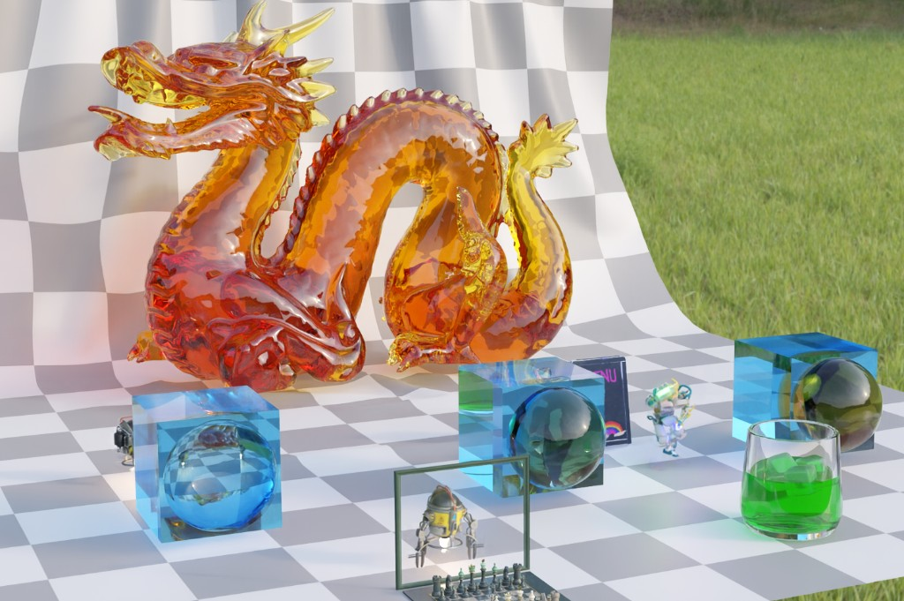
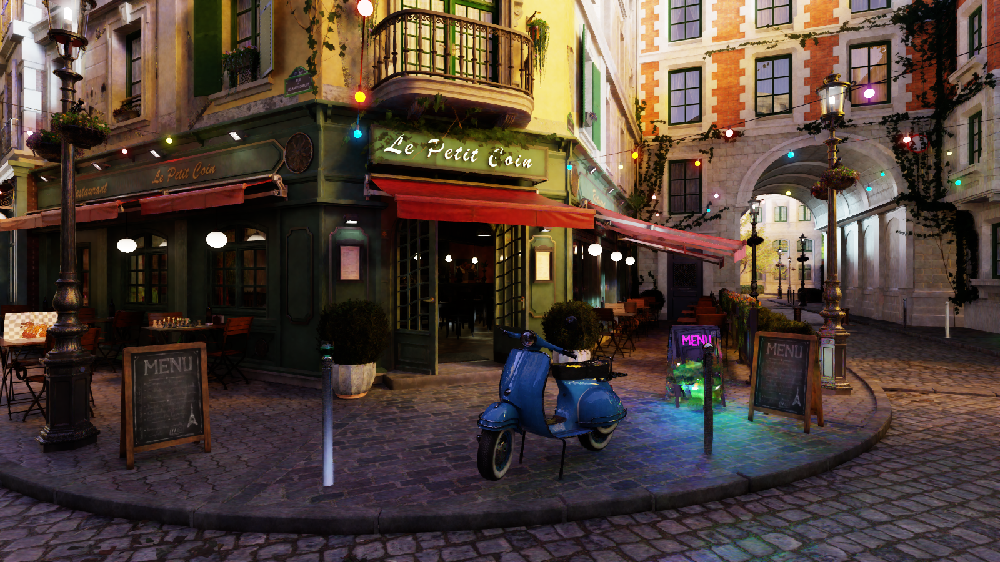
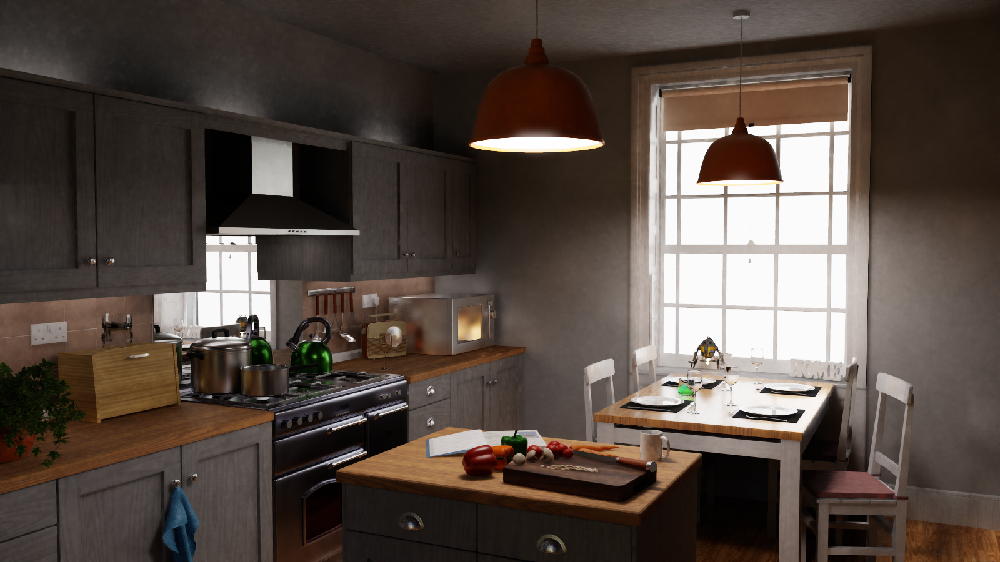

# Caustica

<p align="center">
  
</p>

<p align="center">
  
  &nbsp;
  
</p>

<p align="center"><i>Path-traced synthetic imagery for embodied-AI simulation: material showcase (top), outdoor bistro and indoor kitchen environments (bottom).</i></p>

## Overview

Caustica is a modern ray tracing renderer aimed primarily at **embodied AI and robotics simulation** — generating photorealistic synthetic images, multi-view camera feeds, and ground-truth-quality references for perception, manipulation, and sim-to-real workflows.

It takes **RTX Path Tracing (RTXPT)** as its functional and shading reference, but reimplements the runtime around a cleaner engine architecture that is easier to embed in simulation stacks:

* **Simulation-friendly runtime** — Bevy-inspired ECS (`App`, `Plugin`, `ecs::World`, `AppSchedule` systems) for scenes made of robots, objects, lights, and cameras that update every simulation step
* **Production-style rendering** — Unreal Engine–inspired pipeline (`WorldRenderer`, render graph, pass features) for stable real-time previews and batch offline captures from the same scene description
* **Physically based imagery** — path-traced diffuse/specular/transmission/fuzz (**OpenPBR**), dynamic lighting (**ReSTIR DI/GI/PT**), and denoising/upscaling (**NRD**, **DLSS**) to reduce the visual gap between synthetic and real sensor data

Typical embodied-AI uses include: domain-randomized tabletop/manipulation scenes, indoor navigation environments, multi-camera rig rendering, scripted material/lighting variations, and headless dataset generation from Python.

At a high level:

* **Application & simulation layer** — Bevy-inspired ECS: `App` / `EngineApp`, `Plugin`, `ecs::World`, resources, ordered `AppSchedule` systems, and default `SystemSet`s (`Simulation` → `TransformPropagate` → `Extract`).
* **Rendering layer** — Unreal Engine–inspired pipeline: dedicated `RenderThread`, extract proxies, `WorldRenderer`, render features, pass graph (`GraphBuilder` + parallel waves), and optional `EnqueueRenderCommand` for Logic→RT work.
* **Path tracing core** — RTXPT-derived shaders and algorithms, including **ReSTIR PT**, **ReSTIR GI**, **ReSTIR DI**, NEE-AT, path-space decomposition, denoiser guides, NRD, and **DLSS**, wired through the engine stack

The main mesh renderer is a pure path tracer (no rasterization in its light-transport path), while 3D Gaussian Splats use their dedicated render path. Both are available for **interactive simulation preview** and **offline / headless synthetic-data rendering**.

## Embodied AI & simulation rendering

Caustica is designed as a **rendering backend** for embodied-intelligence pipelines, not as a full physics or robot-control simulator. A typical integration looks like:

```
Simulation / policy stack          Caustica
─────────────────────────          ────────
physics, kinematics, control  →     scene ECS update (poses, joints, attachments)
sensor rig definition         →     scene JSON cameras + Python camera API
domain randomization          →     `.material.json` / lights / env maps / scene variants
batch or online inference     →     headless `caustica.Renderer`, accumulation, PNG/export
```

What fits embodied-AI workflows well:

| Need | Caustica capability |
| --- | --- |
| Programmatic scenes | [Scene JSON](docs/scene-json.md) — models, transforms, lights, cameras, animation channels |
| Consistent object appearance | **OpenPBR** materials + glTF import with per-model `.material.json` overrides |
| Multi-view / sensor rigs | Multiple scene cameras; runtime camera selection and transform control via Python/C++ |
| Interactive + batch modes | Real-time path tracing with denoisers; reference accumulation for ground-truth frames |
| Headless farm rendering | Python `Renderer(..., headless=True)` — no window/swap chain; see `examples/python/render.py` |
| Automation & tuning | Python extension (`pip install .`) for offline jobs; embed mode for live parameter edits in the editor |
| Dynamic environments | Scene graph animation, emissive/analytic lights, environment maps, 3D Gaussian splats |

Recommended starting points:

* Build, runtime layout, and command line: [docs/build-and-run.md](docs/build-and-run.md)
* C++ embedding with `EngineApp`: [docs/embedding-cpp.md](docs/embedding-cpp.md)
* Scene authoring: [docs/scene-json.md](docs/scene-json.md)
* Materials for sim-to-real variation: [docs/openpbr.md](docs/openpbr.md)
* RTXCR skin transport: [docs/rtxcr-skin.md](docs/rtxcr-skin.md)
* ECS + render proxies: [docs/architecture-render-proxy.md](docs/architecture-render-proxy.md)
* RHI / render-thread contract: [docs/architecture-rhi-threading.md](docs/architecture-rhi-threading.md)
* Python batch/headless API: [py_caustica.md](py_caustica.md), `examples/python/render.py`
* Minimal C++ host (no editor): `examples/cpp/thin_client` → target `caustica_thin_client`

## Architecture

```
EngineApp / App (frame loop, plugins, schedules)
 └── App world (resources) + SceneEntityWorld (scene ECS)
      ├── Startup / First / preUpdate
      ├── update (SystemSet.Simulation)     — gameplay / animation / host systems
      ├── PostUpdate (TransformPropagate)   — hierarchy refresh after other PostUpdate work
      ├── Extract (SystemSet.Extract)       — ECS → SceneRenderData proxies (triple-buffered)
      ├── dispatch render (RT)              — WorldRenderer reads proxies only (no live ECS)
      └── postRender / Last (Logic)         — run after dispatch; RT may still be in flight

WorldRenderer (UE-like render pipeline)
 ├── PathTracingContext            — persistent GPU state, settings, bindings
 ├── RenderPipelineRegistry        — ordered render features / plugins
 ├── Frame graph (GraphBuilder)    — waves, transient targets, parallel deferred lists
 └── Path-trace / ReSTIR / NRD / DLSS features
```

**ECS × Render Proxy:** the logic thread owns `SceneEntityWorld`; Extract copies lights/meshes into `LightRenderProxy` / `MeshInstanceRenderProxy`; the render thread consumes `Scene::getRenderData()` / committed proxies and must not walk live ECS for frame lighting. Runtime spawn/despawn publishes a new extract generation and builds mesh/AS/SBT work on the render thread asynchronously (see [architecture-render-proxy.md](docs/architecture-render-proxy.md)).

**Embedding:** prefer `EngineApp::create` → `addSystem` / `EntityWorld` / `Query<>` → `run()` (Startup is automatic). Scene edits go through `EntityWorld::spawn` / focused APIs (`SceneSpawn`, `SceneTransform`, …). Occasional render-thread work from Logic uses `EnqueueRenderCommand`.

* **Application & simulation layer** — Bevy-inspired: `EngineApp`, `App`, `Plugin`, `AppSchedule`, `SystemSet`, scene ECS components.
* **Rendering layer** — UE-inspired: dedicated `RenderThread`, extract proxies, `WorldRenderer`, `FrameCommandContext` / GraphBuilder waves.
* **Path tracing core** — RTXPT-derived shaders (ReSTIR, NEE-AT, NRD, DLSS) wired through the proxy packet.

Key code locations:

| Layer | Paths |
| --- | --- |
| Embed entry | `caustica/caustica/include/engine/EngineApp.h` |
| App & schedules | `caustica/caustica/include/engine/App.h`, `AppSchedules.h`, `SystemSets.h`, `Plugin.h` |
| Logic → RT enqueue | `caustica/caustica/include/engine/EnqueueRenderCommand.h` |
| Scene edit / query APIs | `SceneSpawn.h`, `SceneTransform.h`, `MeshDeformApi.h`, `SceneQuery.h`, `CameraApi.h`, … |
| ECS core | `caustica/caustica/include/ecs/` |
| Scene ECS | `caustica/caustica/include/scene/SceneEcs.h` |
| Render proxies | `caustica/caustica/include/scene/SceneRenderData.h`, `docs/architecture-render-proxy.md` |
| RHI threading | `docs/architecture-rhi-threading.md` |
| World renderer | `caustica/caustica/include/render/WorldRenderer.h`, `caustica/caustica/src/render/WorldRenderer*.cpp` |
| Render graph | `caustica/caustica/include/render/graph/` |
| Materials (OpenPBR) | `caustica/caustica/src/render/passes/lighting/MaterialGpuCache.cpp`, `caustica/caustica/shaders/PathTracer/Rendering/Materials/BxDF.hlsli` |
| Path tracing shaders | `caustica/caustica/shaders/PathTracer/` |
| Desktop editor | `application/editor/app/Main.cpp` |
| Thin client sample | `examples/cpp/thin_client/Main.cpp` |

## Features

### Simulation integration

* **Scene JSON** workflow for reproducible environments, object placement, lights, and camera rigs
* **ECS scene graph** (`SceneEntityWorld`) — entities/components map naturally to simulated actors and attachments
* **`EngineApp` embed path** — one-call bootstrap for custom hosts; official thin client at `examples/cpp/thin_client`
* **Python extension** — headless and windowed `Renderer`, spawn/despawn, materials/lights/cameras, accumulation for dataset generation
* **Reference + real-time modes** — interactive policy/debug preview and high-SPP offline captures from the same scene
* Asset import for props, robots, and scanned environments: glTF / OBJ / URDF / USD (+ animation channels)

### Path tracing & light transport

* Pure path tracer — no rasterization in the main light transport path
* Reference and real-time modes
* Simple BSDF model that is easy(ish) to extend
* Volumes and nested dielectrics with priority
* Analytic lights (directional, spot, point), emissive triangles, and environment map lighting
* NEE with feedback-based, temporally adaptive guided importance sampling (NEE-AT)
* Low-discrepancy sampling ([Practical Hash-based Owen Scrambling](https://jcgt.org/published/0009/04/01/paper.pdf)), RayCones for texture MIP selection, RR early termination, firefly filter

### ReSTIR / RTXDI (via RTXDI SDK)

Integrated through `RtxdiPass` and RTXDI compute/ray-tracing shaders:

* **ReSTIR DI** — resampled direct illumination for analytic and emissive lights; temporal/spatial resampling, checkerboard modes, fused DI+GI final shading
* **ReSTIR GI** — resampled indirect lighting from secondary hits; temporal/spatial resampling and boiling filter
* **ReSTIR PT** — path-level resampling with initial sampling, hybrid shift, reconnection, temporal/spatial resampling, and boiling filter
* ReGIR light presampling support for large light counts

Key paths: `caustica/caustica/src/render/passes/rtxdi/`, `caustica/caustica/shaders/render/rtxdi/`

### Denoising, anti-aliasing & upscaling

* **NRD** — ReLAX and ReBLUR with up to 3-layer path-space decomposition
* **DLSS** (when enabled at build time):
  * **DLSS Super Resolution (SR)** — spatial upscaling via Streamline (Windows) or native NGX (Linux Vulkan)
  * **DLSS Ray Reconstruction (RR)** — neural denoising/AA using path-tracing guide buffers (diffuse/specular albedo, normal/roughness, motion, depth)
  * **DLSS AA** and quality presets (Performance / Balanced / Quality / DLAA, etc.)
  * **DLSS Frame Generation (FG)** and Reflex via Streamline on Windows
* TAA, tone mapping, bloom, and accumulation for non-DLSS paths
* Reference-mode OptiX denoiser for offline captures

### OpenPBR material system

Caustica uses **OpenPBR** as the built-in material model on top of the internal `StandardMaterial` GPU/shader backend. Scene materials are authored in `Assets/Materials/*.material.json` (see [scene JSON](docs/scene-json.md#材质覆盖)); existing legacy field names remain valid.

* **Authoring** — write parameters in OpenPBR snake_case (`base_color`, `coat_weight`, `subsurface_radius`, …) or inside an `OpenPBR` JSON block; existing PascalCase fields still load and bake to the same GPU layout
* **Shader lobes** — diffuse/base, GGX specular (with **anisotropy**), specular/diffuse **transmission**, **fuzz**, **coat** (with darkening), **thin-film** iridescence, **dispersion**, and RTXCR **subsurface** (Burley BSSRDF + ray-traced single scattering/transmission)
* **Editor UI** — material inspector shows OpenPBR parameter names and maps them to `StandardMaterial` / GPU constants

Approximate vs full spec: subsurface uses RTXCR's real-time Burley diffusion profile plus one-sample ray-traced transmission/single scattering rather than a full random walk; coat/base share one shading normal; energy balance is approximate (Turquin MS + coat attenuation).

Example:

```json
{
  "OpenPBR": {
    "base_color": [0.55, 0.48, 0.40],
    "base_metalness": 0.0,
    "specular_weight": 0.45,
    "specular_roughness": 0.82,
    "specular_roughness_anisotropy": 0.45,
    "fuzz_weight": 0.35,
    "fuzz_roughness": 0.75
  },
  "NormalTexture": { "path": "Textures/weave_n.dds", "NormalMap": true }
}
```

Key paths: `caustica/caustica/src/render/passes/lighting/MaterialGpuCache.cpp`, `caustica/caustica/shaders/PathTracer/Rendering/Materials/BxDF.hlsli`

Full field reference: [OpenPBR materials](docs/openpbr.md)

### Rendering platform & assets

* DirectX 12 and Vulkan back-ends
* Shader Execution Reordering (SER) and Opacity Micromaps (OMM) on supported DXR 1.2 builds
* glTF 2.0 asset pipeline (subset of extensions, including animation) with **OpenPBR** `.material.json` overrides
* RTXTF stochastic texture filtering
* 3D Gaussian Splat rendering and shadow proxy support

## Requirements

- C++20 compiler and CMake 3.18 or newer
- Ray-tracing-capable GPU and a recent vendor driver
- DirectX 12 on Windows, or Vulkan on Windows/Linux/WSL
- Visual Studio 2022 with x64 build tools for the primary Windows configuration
- Python 3.8+ development files when `CAUSTICA_WITH_PYTHON=ON` (default)
- Recursive Git submodules, including the separate `Assets` repository

See [Building and running Caustica](docs/build-and-run.md) for backend-specific prerequisites and optional SDKs.

## Known Issues

* Agility SDK `1.619.0` is selected by default on Windows. If the target GPU/driver cannot use the required DXR feature level, configure with an empty `CAUSTICA_D3D_AGILITY_SDK_VERSION_NAME`, recreate the build directory, and rebuild.
* Enabling Vulkan support requires a couple of manual steps; see [Building Vulkan](#building-vulkan).
* SER and OMM support on Vulkan is currently work in progress.
* Running Vulkan on AMD GPUs may trigger a TDR during TLAS building in scenes with null TLAS instances.
* Enabling the Vulkan debug layer will show a number of warnings and errors; fixes are work in progress.
* For frame capture and GPU profiling, a vendor graphics debugger is recommended. If using tools such as PIX on Windows, disable `CAUSTICA_RHI_WITH_NVAPI` and `CAUSTICA_WITH_STREAMLINE` in CMake to avoid compatibility issues. Disabling these settings reduces performance and removes some features.
* There is a known issue resulting in LIVE_DEVICE DirectX warnings at shutdown when Streamline is enabled in Debug builds.
* There is a known issue with black or incorrect transparencies/reflections on some AMD systems with recent drivers.

## Folder Structure

| | |
| - | - |
| `/bin` | default CMake folder for binaries and compiled shaders |
| `/build` | default CMake folder for build files |
| `/Assets` | models, textures, scene files |
| `/docs` | build, embedding, architecture, scene JSON, OpenPBR, and related docs |
| `/External` | external libraries and SDKs, including Streamline, NRD, RTXDI, and OMM |
| `/support` | Python packaging / shader cook scripts and optional CLI tools |
| `/caustica` | engine tree: `caustica/caustica/` (C++), `Python/` bindings, shaders |
| `/application/editor` | desktop editor — entry point at `app/Main.cpp` |
| `/examples/cpp/thin_client` | minimal `EngineApp` host (no editor UI) |
| `/examples/python` | Python embed and extension examples |
| `/python/caustica` | pip package loader for the native extension |
| `/caustica/caustica/shaders/PathTracer` | core path tracing shaders |

## Build

Windows is the primary supported platform. Linux/WSL builds use Vulkan. For the complete option matrix, optional SDK setup, runtime file layout, and troubleshooting, read [Building and running Caustica](docs/build-and-run.md).

1. Clone the repository **with all submodules recursively**:

   ```powershell
   git clone --recursive https://github.com/fenghuayumo/caustica/
   cd caustica
   ```

2. Configure a 64-bit Visual Studio build:

   ```powershell
   cmake -S . -B build -G "Visual Studio 17 2022" -A x64
   ```

3. Build and run the editor:

   ```powershell
   cmake --build build --config Release --target caustica
   .\bin\caustica.exe --scene default.json
   ```

Optional application targets are `caustica_thin_client` (minimal C++ host) and `caustica_py` (Python extension). Binaries and cooked shaders land under `bin/`; assets are discovered in `Assets/` beside the runtime directory or one directory above it.

To build a new C++ host, start with the [C++ embedding guide](docs/embedding-cpp.md) and `examples/cpp/thin_client`.

## Python Extension Install

Caustica builds a standalone Python extension for **headless synthetic-data rendering**, batch scene sweeps, and simulation-side automation. After building the `caustica_py` target, install it into the active Python environment from the repository root:

```
python -m pip install .
python -c "import caustica; print(caustica.MODE)"
```

The pip build assembles a local binary wheel from `bin/`, including the native extension, runtime DLLs/so files, shaders, and a minimal asset payload. The payload can be adjusted with environment variables:

| Variable | Default | Values |
| --- | --- | --- |
| `CAUSTICA_WHEEL_VERSION` | `0.6.0` | Any PEP 440 version |
| `CAUSTICA_WHEEL_ASSETS` | `minimal` | `minimal`, `full`, `none` |
| `CAUSTICA_WHEEL_DYNAMIC_SHADERS` | `bin` | `bin`, `full`, `none` |
| `CAUSTICA_WHEEL_SHADER_API` | `d3d12` on Windows, `vulkan` elsewhere | `d3d12`, `vulkan`, `both` |
| `CAUSTICA_WHEEL_SHADER_PACK` | `true` | `true`, `false` |

By default, wheel builds **cook the coverage PT feature-preset matrix**, verify bins, and package them into `caustica.shaders.<api>.pack` (load-only runtime; no DXC beside the binary).

You can also build a wheel explicitly:

```
python support/python/build_wheel.py
python -m pip install dist/caustica-*.whl
```

### Official shader cook (required for release / load-only)

UE-style two-layer model:

1. **Offline cook (shader libraries)** — closed feature-preset matrix (`coverage`: single-axis + curated combos like `ReSTIR_DI_OMM`). DXC writes hash-addressed objects to `ShaderBin/{dxil|spirv}/` and optionally `caustica.shaders.<api>.pack`. Runtime must **not DXC** on UI toggles.
2. **Runtime RT PSOs** — `CreateStateObject` is device-local and hit-group dependent; it is **not** a `.bin` cook artifact. The app CreateStateObjects only the **active** preset on first use / switch, then binds. Interactive frames never background-warm the other ~25 presets.

```
# Official library cook: coverage precompile + verify + shader pack
python support/python/cook_shaders.py --shader-api d3d12

# Optional: GPU-validate CreateStateObject for every preset on the cook machine
python support/python/cook_shaders.py --shader-api d3d12 --precache-rt-psos

# Or via CMake targets (writes under bin/)
cmake --build build --target causticaPathTracerShaders   # cook + verify bins
cmake --build build --target causticaShaderPack          # package .pack from bins
```

Distribution builds (`-DCAUSTICA_DISTRIBUTION_BUILD=ON`) default to packaging the shader pack (`CAUSTICA_PACKAGE_SHADER_PACK=ON`). Place `caustica.shaders.<api>.pack` next to the executable.

If a cooked library bin is missing at runtime (load-only):

```
python support/python/cook_shaders.py --global-preset coverage
```

Load-time precache (optional, not the frame loop):

```
renderer.step_n(1)
renderer.precache_rt_feature_presets()
```

## Building Vulkan

Vulkan is off by default on Windows and on by default elsewhere. On Windows:

```powershell
cmake -S . -B build-vk -G "Visual Studio 17 2022" -A x64 `
  -DCAUSTICA_WITH_VULKAN=ON
cmake --build build-vk --config Release --target caustica
.\bin\caustica.exe --backend vulkan
```

Install the Vulkan SDK first and set `DXC_SPIRV_PATH` if CMake cannot locate its SPIR-V-capable `dxc`. The root option is `CAUSTICA_WITH_VULKAN`; internal `CAUSTICA_RHI_WITH_VULKAN` is derived automatically.

## Building Linux / WSL

Linux and WSL default to Vulkan and disable DirectX 12 Agility SDK, NVAPI, and Streamline. After installing the compiler, window-system development packages, and Linux Vulkan SDK:

```bash
cmake -S . -B build-linux -G Ninja \
  -DCAUSTICA_WITH_VULKAN=ON \
  -DDXC_SPIRV_PATH="$VULKAN_SDK/bin/dxc"
cmake --build build-linux --config Release --target caustica
```

Native NGX DLSS defaults on with Vulkan; use `-DCAUSTICA_WITH_NATIVE_DLSS=OFF` for a build without NGX. OIDN defaults on for x86-64 Linux. See [the full build guide](docs/build-and-run.md#linux-and-wsl) for packages and optional configurations.

## DirectX 12 Agility SDK

Caustica optionally integrates the [DirectX 12 Agility SDK](https://devblogs.microsoft.com/directx/directx12agility/). `CAUSTICA_D3D_AGILITY_SDK_VERSION_NAME` selects and downloads the SDK; the current default is `1.619.0`. CMake derives the SDK path and numeric version.

Set the version-name option to an empty value to use the system D3D12 runtime, or select one of the preview values listed in the root `CMakeLists.txt`. Recreate the build directory when switching. See [the Agility SDK section](docs/build-and-run.md#directx-12-agility-sdk).

## Multi-GPU Selection

Caustica supports backend-neutral GPU selection on DX12 and Vulkan. When no
selector is supplied, the default `auto` mode enumerates the selected backend,
removes software or path-tracing-incompatible devices, and chooses the suitable
GPU with the highest capability score. The score considers hardware class,
required ray-tracing features, device-local memory, and compute limits where
the backend exposes useful comparable values. It is a selection heuristic
rather than a benchmark. Equal scores prefer the
lower enumerated index.

| Selector | Meaning | Example |
| --- | --- | --- |
| `auto` | Choose the strongest suitable GPU. This is the default. | `--gpu auto` |
| `index:N` | Select the current backend enumeration index. | `--gpu index:1` |
| `name:text` | Case-insensitive device-name substring. It must match exactly one device. | `--gpu "name:RTX 5090"` |
| `uuid:hex` | Select a Vulkan/device UUID. | `--gpu uuid:00112233445566778899aabbccddeeff` |
| `luid:hex` | Select a Windows adapter LUID. | `--gpu luid:a100010000000000` |

Explicit selectors are strict: unavailable, unsuitable, or ambiguous devices
cause device creation to fail instead of silently switching GPUs. Indices can
change after driver or hardware updates, so UUID/LUID selectors are preferred
for persistent render-worker configuration.

```powershell
# Default backend, strongest compatible GPU
.\bin\caustica.exe --gpu auto

# Vulkan adapter 1
.\bin\caustica.exe --backend vulkan --gpu index:1
```

Python can enumerate devices without constructing a renderer and can report the
adapter ultimately selected by `auto`:

```python
import caustica

for gpu in caustica.enumerate_adapters(vulkan=False):
    print(gpu.index, gpu.name, gpu.type, gpu.luid, gpu.suitable)

with caustica.Renderer(adapter="auto", headless=True) as renderer:
    print("using", renderer.selected_adapter)
```

See [the Python GPU-selection reference](py_caustica.md#gpu-selection) for all
adapter fields and stable-selector examples.

## Command Line

Run `caustica.exe --help` for the parser-generated complete list.

- `--scene <file>` selects a scene.
- `--width <px> --height <px>` and `--fullscreen` configure the window.
- `--backend <dx12|d3d12|vulkan|vk>` selects a compiled backend; `--vk` and `--vulkan` are aliases.
- `--debug` and `--gpu <selector>` configure device creation; see
  [Multi-GPU Selection](#multi-gpu-selection).
- `--noWindow` creates an offscreen/headless device; `--syncRender` disables the dedicated render thread.
- `--pythonScript <file>` and `--pythonExpr <expr>` run automation after scene load.

Rendering overrides and capture-sequence options are listed in [the command-line reference](docs/build-and-run.md#command-line).

## Developer Documentation

* [Build and run](docs/build-and-run.md)
* [C++ embedding](docs/embedding-cpp.md)
* [Scene JSON format](docs/scene-json.md)
* [OpenPBR materials](docs/openpbr.md)
* [RTXCR skin integration](docs/rtxcr-skin.md)
* [ECS + render proxies](docs/architecture-render-proxy.md)
* [RHI threading contract](docs/architecture-rhi-threading.md)
* [Python API reference](py_caustica.md)
* [Python examples](examples/python/README.md)

## Contact

Caustica is under active development. Please report issues through the repository issue tracker.

## Thanks

Thanks to the developers of the following open-source libraries and projects:

* dear imgui (https://github.com/ocornut/imgui)
* DirectX Shader Compiler (https://github.com/microsoft/DirectXShaderCompiler)
* cgltf, single-file glTF 2.0 loader (https://github.com/jkuhlmann/cgltf)
* Krzysztof Narkowicz's real-time BC6H compression on GPU (https://github.com/knarkowicz/GPURealTimeBC6H)
* okdshin's PicoSHA2 (https://github.com/okdshin/PicoSHA2)
* ...and any we might have forgotten (please let us know)

## Citation

If you use Caustica in a research project that leads to a publication, please cite the project. Example BibTeX:

```bibtex
@online{caustica,
   title   = {Caustica: A Real-Time Hybrid Path Tracing Rendering Library for Meshes and 3D Gaussian Splatting},
   author  = {Bingyang Hu},
   year    = {2026},
   url     = {https://github.com/fenghuayumo/caustica/},
}
```
